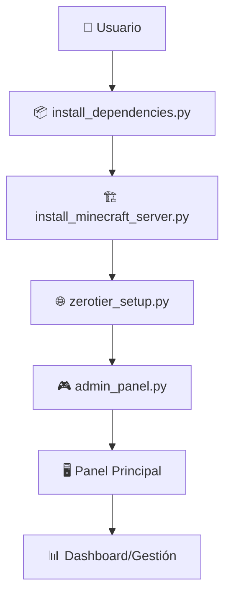

# Flujo de Archivos del Sistema de Administración de Servidor Minecraft

Este documento describe el flujo de archivos y cómo interactúan entre sí para construir un sistema completo de servidor Minecraft en Windows 10/11.

## 🚀 Flujo General del Sistema

## Fase 1: Preparación del Entorno

- **Archivo:** `install_dependencies.py`
- **Propósito:** Preparar el sistema, verificar requisitos e instalar dependencias necesarias.
- **Flujo:**
  - Verificar la versión de Python y Java.
  - Instalar librerías Python: `rich`, `psutil`, `requests`, `schedule`.
  - Crear archivos batch y archivo `requirements.txt`.

## Fase 2: Instalación del Servidor

- **Archivo:** `install_minecraft_server.py`
- **Propósito:** Descargar e instalar el servidor Minecraft.
- **Flujo:**
  - Crear directorio `C:\MinecraftServer`.
  - Obtener y descargar `server.jar` según opción elegida: Vanilla o PaperMC.
  - Configurar automáticamente el EULA.
  - Ejecutar el servidor por primera vez para generar archivos de configuración.

## Fase 3: Configuración de Red

- **Archivo:** `zerotier_setup.py`
- **Propósito:** Configurar acceso remoto seguro con ZeroTier.
- **Flujo:**
  - Verificar e instalar ZeroTier si es necesario.
  - Unirse a redes existentes o crear nuevas.
  - Mostrar estado de conexión y IP asignada.

## Fase 4: Panel de Administración

- **Archivo:** `admin_panel.py`
- **Propósito:** Proveer una interfaz visual completa para administrar el servidor.
- **Flujo:**
  - Sistema de autenticación opcional con PIN.
  - Menú principal para gestionar servidor, usuarios, red, seguridad y más.
  - Dashboard en tiempo real con estadísticas del sistema y del servidor.

## Funcionalidades Empresas:

- **Dashboard en Tiempo Real:**
  - Monitoreo de CPU, RAM, disco, jugadores conectados, y output del servidor.

- **Sistema de Backups:**
  - Backups automáticos y manuales con restauración.

- **Gestión de Red:**
  - ZeroTier para conexiones remotas seguras.

- **Gestión de Usuarios:**
  - Operadores, lista blanca, y sistema de baneos.

## Interacciones entre Archivos:

- `install_dependencies.py` instala todas las dependencias necesarias para que`install_minecraft_server.py` implemente el servidor de Minecraft descargando los archivos requeridos.
- `zerotier_setup.py` permite la configuración de la red privada y puede ser llamado desde el panel de administración con subprocess.
- `admin_panel.py` actúa como el controlador principal, manejando todas las funciones necesarias una vez que el servidor está configurado e implementado.

Cada componente tiene un propósito definido y se comunica a través de flujos lógicos claros para gestionar un servidor de Minecraft eficiente y seguro.
